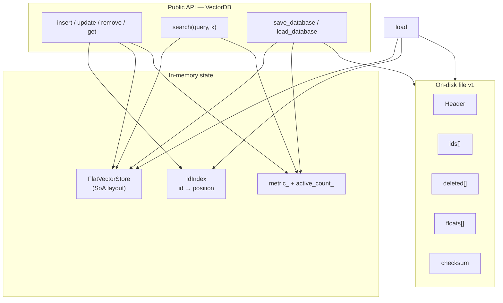
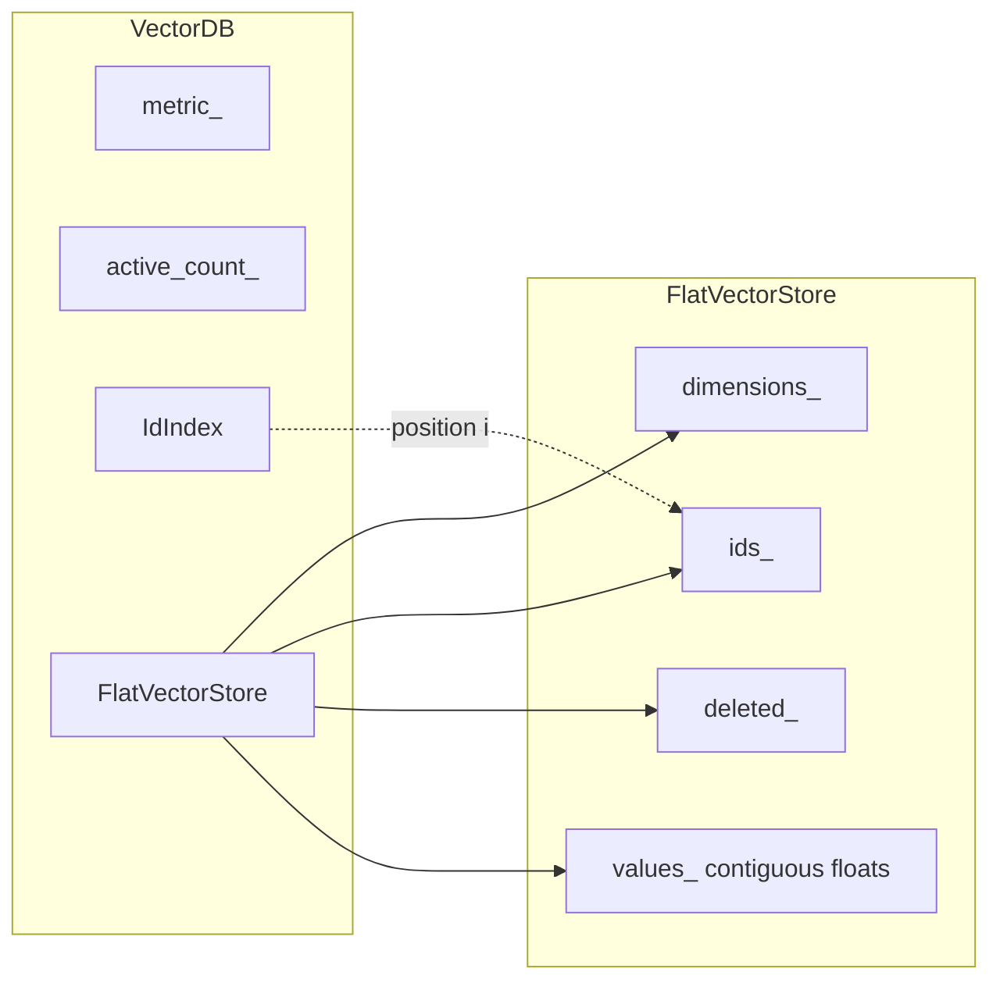

# VectorDB From Scratch — Learning Journey

A small vector database in **C++20**, built milestone by milestone to learn the data structures and systems ideas behind real vector stores.

This is a **learning project**, not a production competitor to Faiss/Milvus/etc. The long curriculum lives in [`README_VectorDB_From_Scratch.md`](README_VectorDB_From_Scratch.md). This README is the **story of what we’ve built and learned so far**.

---

## Current status

| Milestone | Status | Tag / notes |
|-----------|--------|-------------|
| 0 — Design document | Done | [`notes/00-design.md`](notes/00-design.md) |
| 1a — `VectorStore` (AoS) | Done | Record-per-vector |
| 1b — `FlatVectorStore` (SoA) | Done | Contiguous floats |
| 1c — A vs B scan benchmark | Done | [`notes/01-memory-layout.md`](notes/01-memory-layout.md) |
| 2 — ID index + CRUD | Done | `unordered_map` (skipped custom open-addressing for now) |
| 3 — Distance metrics | Done | Cosine, dot, squared Euclidean |
| 4 — Exact top-k search | Done | Tag **`v0.1-in-memory-exact`** |
| 5 — Binary persistence | In progress | Format sandbox done; `write_header` + SoA `write_payload` done; `save_database` / `load_database` next |

---

## Architecture (how the pieces connect)



### What’s inside one `VectorDB`



**Row `i`:** `ids_[i]` + `deleted_[i]` + floats at `values_[i × dimensions …]`.

| Operation | Path |
|-----------|------|
| `get(101)` | id → `IdIndex` → position → `values_at` (if not deleted) |
| `search(q, k)` | scan physical rows, skip tombstones, score, keep top-k in a heap |
| `save` | header + SoA payload + checksum (rebuild index on load) |

---

## Learning journey by milestone

### Milestone 0 — Define the product before coding

**Learned:** fixed decisions beat vague APIs. We locked:

- Fixed dimensions, `float` components, `uint64_t` ids  
- Duplicate insert → error; delete → tombstone  
- Errors via `Status`; higher-is-better scores (negate Euclidean for ranking)  
- Library-first; HTTP later  

**Resource mindset:** only read what the current milestone needs.

**Artifact:** [`notes/00-design.md`](notes/00-design.md)

---

### Milestone 1 — Memory layout (AoS vs SoA)

**Learned:**

- **Version A (AoS):** each row owns a `std::vector<float>` → simple, scattered payloads  
- **Version B (SoA):** one big float slab → better sequential scan locality  
- Layout wins are **workload-dependent** (cache vs DRAM bandwidth)  
- Benchmarks lie if you discard results (`-O3` DCE) or run unoptimized  

```text
Version A:  [Rec][Rec][Rec] → each Rec points elsewhere to floats
Version B:  ids_ | deleted_ | values_ = [v0|v1|v2|...] contiguous
```

**Resources:**

- [cppreference: `std::vector`](https://en.cppreference.com/w/cpp/container/vector)  
- [What Every Programmer Should Know About Memory](https://people.freebsd.org/~lstewart/articles/cpumemory.pdf) (skim)  

**Artifact:** [`notes/01-memory-layout.md`](notes/01-memory-layout.md) + `benchmarks/storage_layout_benchmark.cpp`

---

### Milestone 2 — ID → position

**Learned:**

- Storage is addressed by **position**; users speak **ids**  
- `IdIndex` maps `uint64_t → size_t`  
- `map_[id]` inserts on miss — use `find` for lookup  
- Skipped custom open-addressing (already knew the topic); `unordered_map` is fine for now  

```text
insert(101, vec) → append to store at position p → index[101] = p
get(101)         → index.find(101) → store.values_at(p)
```

**Resources:**

- [Stanford CS166: Hashing](https://web.stanford.edu/class/archive/cs/cs166/cs166.1256/lectures/04/)  
- [MIT OCW: Hashing](https://ocw.mit.edu/courses/6-006-introduction-to-algorithms-fall-2011/resources/lecture-8-hashing-with-chaining/)  

---

### Milestone 3 — Similarity

**Learned:**

| Function | Meaning | For ranking |
|----------|---------|-------------|
| `dot_product` | Σ aᵢbᵢ | higher better |
| `cosine_similarity` | dot / (‖a‖‖b‖); zero vec → `0` | higher better |
| `squared_euclidean` | Σ (a−b)² (no √) | lower better → search uses **negated** value |

**Resources:**

- [3Blue1Brown: Dot products](https://www.3blue1brown.com/lessons/dot-products)  
- [Floating Point Guide](https://floating-point-gui.de/)  

---

### Milestone 4 — Exact top-k search → Version 0.1

**Learned:**

- Exact = score **every** active vector (ground truth for later HNSW)  
- Keep a **min-heap of size k** (worst of the best on top); pop when size > k  
- Custom comparator compares **`.score` only**; `id` is payload  
- `priority_queue` “largest” on top → define “less than” as higher score for a min-heap  

```text
for each non-deleted row:
  score = score_pair(query, values)   // higher better
  push {id, score}; if heap.size() > k: pop
return best-first
```

**Complexity:** `O(n·d)` distances + `O(n log k)` heap.

**Resources:**

- [MIT OCW: Heaps](https://ocw.mit.edu/courses/6-006-introduction-to-algorithms-fall-2011/resources/lecture-4-heaps-and-heap-sort/)  
- [cppreference: `priority_queue`](https://en.cppreference.com/w/cpp/container/priority_queue)  

**Release:** `git tag v0.1-in-memory-exact`

---

### Milestone 5 — Persistence (in progress)

**Learning so far:**

- A file is a **contract**, not a dumped C++ struct (padding/endianness)  
- **Magic** + **version** + explicit field writes  
- SoA on disk matches FlatVectorStore: header → ids → deleted → floats → checksum  
- `fwrite(ptr, elem_size, count, file)`; scalars need `&field`  
- Checksum = sum of bytes **before** the checksum field; `add_bytes` must take `uint32_t&`  
- `record_count` = physical size (tombstones included); `active_count` = live rows  
- Rebuild `IdIndex` on load — don’t save the hash table  

**File layout v1** (`n` = `record_count`, `d` = `dimensions`):

```text
offset  size          field
------  ------------  --------------------------------
     0  8             magic  "VECDB001"
     8  4             version = 1
    12  4             dimensions        (u32)
    16  8             record_count  n   (u64, incl. tombstones)
    24  8             active_count      (u64, live rows)
    32  4             metric            (0=cos, 1=dot, 2=euclid)
------  ------------  --------------------------------  header = 36 B
    36  8 * n         ids[]             (u64 each)
        1 * n         deleted[]         (u8: 0 or 1)
        4 * n * d     values[]          (float32, row-major)
------  ------------  --------------------------------
         4            checksum (u32) = byte sum of everything above
```

Three separate sections, mirroring `FlatVectorStore`'s SoA memory layout — not one interleaved record per row:

```text
in memory   ids_ | deleted_ | values_
on disk     ids[]  deleted[]  values[]   ← same shape, so save/load is a straight copy
```

**Two bugs worth remembering** (both hit while writing `write_payload`):

1. `sizeof(bool)` is **not guaranteed to be 1** and isn't a stable on-disk type. Convert first:
   `std::uint8_t d = deleted ? 1 : 0;` then `fwrite(&d, 1, 1, file)`.
2. `fwrite(ptr, size, count, file)` — `fwrite(&d, 1, 2, file)` writes **two** bytes from a one-byte
   object. The checksum must cover exactly the bytes written, so `add_bytes(..., &d, 1)` too.

**Sandbox experiments:** `tools/format_sandbox.cpp` (write/read header, payload, checksum by hand).

**Resources:**

- [SQLite database file format](https://www.sqlite.org/fileformat.html) — magic, header, versions (skim §1 / §1.3)  
- [cppreference: fixed-width integers](https://en.cppreference.com/w/cpp/types/integer)  

---

## Repo layout

```text
include/vectordb/   public headers (database, stores, distance, serializer, …)
src/                implementations
tests/              GoogleTest
tools/              CLI + format_sandbox
benchmarks/         storage layout A vs B
notes/              design + learning logs
data/               local binary experiments (gitignored-ish via patterns)
```

---

## Build & test

```bash
cmake -S . -B build
cmake --build build
ctest --test-dir build --output-on-failure
```

```bash
./build/vectordb_cli
./build/format_sandbox          # Milestone 5 learning tool
```

### Benchmark (Release)

```bash
cmake -S . -B build -DCMAKE_BUILD_TYPE=Release
cmake --build build --target storage_layout_benchmark
./build/storage_layout_benchmark
```

---

## How we learn (method)

For each milestone:

1. **Read** — idea + short notes in our own words  
2. **Draw** — layout / data flow (diagrams above)  
3. **Implement** — small steps; tests for behavior  
4. **Benchmark** when layout/speed claims matter  
5. **Reflect** — what broke, what we’d redesign  

Full curriculum & later milestones (WAL, HNSW, …): [`README_VectorDB_From_Scratch.md`](README_VectorDB_From_Scratch.md)

---

## License

Personal / educational use unless otherwise stated.
