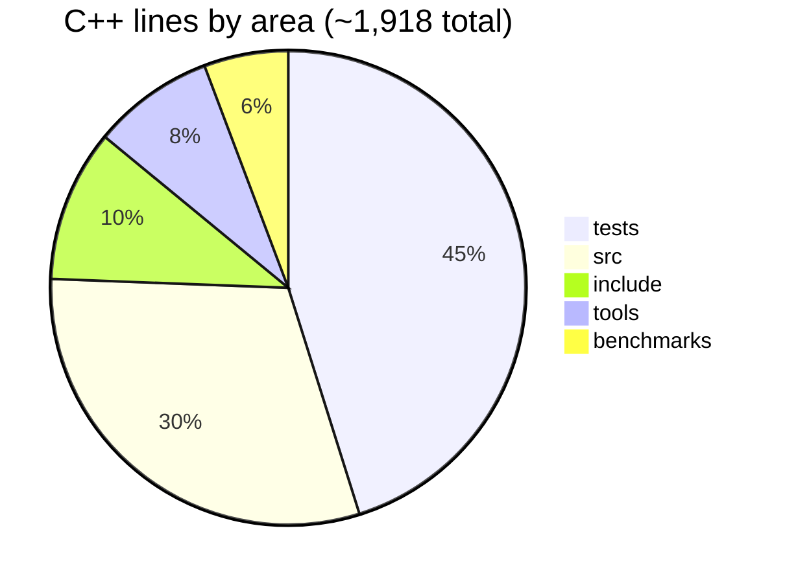
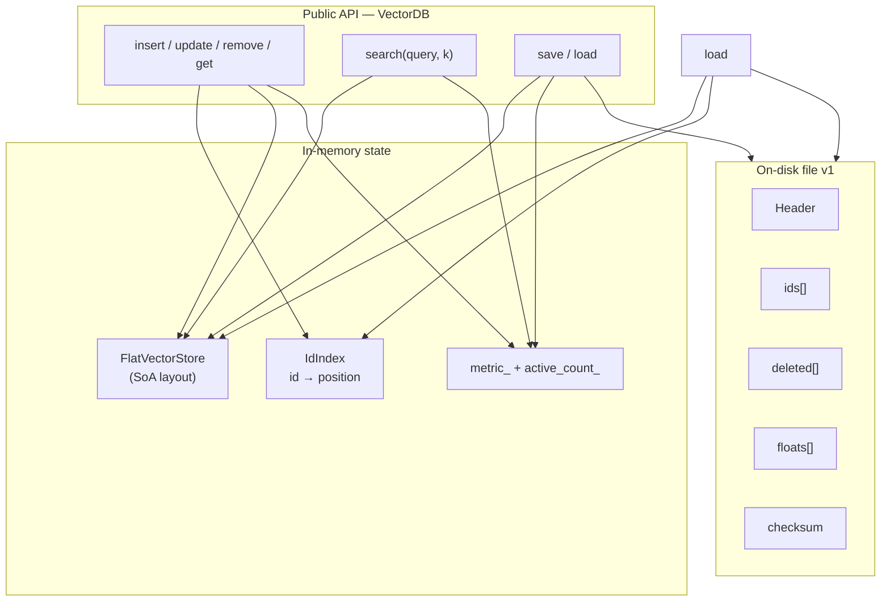
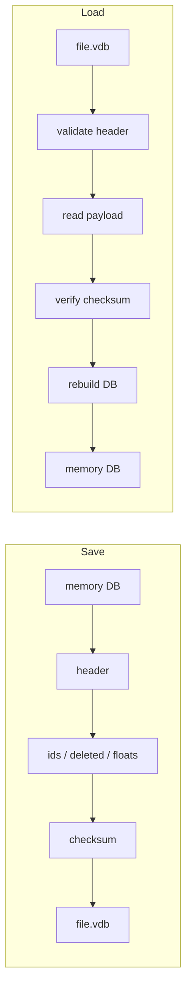

# VectorDB From Scratch — Learning Journey

A small vector database in **C++20**, built step by step to learn the data structures and systems ideas behind real vector stores.

This is a **learning project**, not a production competitor to Faiss/Milvus/etc. The full curriculum lives in [`README_VectorDB_From_Scratch.md`](README_VectorDB_From_Scratch.md). This README is the **story of what I’ve built and learned**.

---

## Where things stand


| Topic | Progress |
|-------|----------|
| Design | Locked: fixed dims, `float`, `uint64_t` ids, tombstones, `Status` |
| Memory layout | AoS + SoA stores; scan benchmark |
| ID index + CRUD | `IdIndex` + `VectorDB` insert/get/update/remove |
| Similarity | Cosine, dot, squared Euclidean |
| Exact top-k | Min-heap search · tag `v0.1-in-memory-exact` |
| Binary persistence | Save/load + checksum · **67** tests green |
| WAL / crash safety | **Next** |



---

## Architecture



---

## Design

**What I learned:** A database starts as a contract, not as code. Before touching C++, we locked the product rules — fixed dimensions, `float` embeddings, `uint64_t` ids, tombstone deletes, `Status` for expected failures. That mirrors how real systems separate the **logical API** from storage engines (same idea as “library first” in CMU-style DB courses: define the interface, then swap implementations).

**Resources / ideas:** treat Version 0.1 as an **exact in-memory** engine so later approximate indexes (HNSW) have a ground-truth baseline. Embeddings are points in ℝᵈ — the DB’s job is store, address, compare, and rank them.

```cpp
enum class Metric { cosine, dot_product, euclidean };

enum class Status {
    ok,
    duplicate_id,
    not_found,
    dimension_mismatch,
    invalid_argument
};

struct SearchResult {
    std::uint64_t id;
    float score;  // higher is better for every metric
};

class VectorDB {
public:
    explicit VectorDB(std::size_t dimensions, Metric metric = Metric::cosine);

    Status insert(std::uint64_t id, std::span<const float> values);
    Status update(std::uint64_t id, std::span<const float> values);
    Status remove(std::uint64_t id);
    std::optional<std::span<const float>> get(std::uint64_t id) const;
    std::vector<SearchResult> search(std::span<const float> query, std::size_t k) const;
    // ...
};
```

---

## Memory layout

**What I learned:** Databases care how data sits in RAM, not just what it means. Version A (AoS) is simple — each row owns its own `vector<float>`. Version B (SoA) puts all floats in one slab so a full scan walks memory sequentially. From *[What Every Programmer Should Know About Memory](https://people.freebsd.org/~lstewart/articles/cpumemory.pdf)*: CPUs hate pointer chasing; **cache lines and DRAM bandwidth** dominate once vectors get wide/large.

**Benchmark takeaway:** at 128-d × 100k, flat layout was ~1.32× faster; at ~512 MB of floats both hit DRAM bandwidth and the gap vanished. Also learned that benchmarks lie if you discard results (`-O3` dead-code-eliminates the scan) or run unoptimized builds.

```text
Version A:  [Rec][Rec][Rec] → each Rec points elsewhere to floats
Version B:  ids_ | deleted_ | values_ = [v0|v1|v2|...] contiguous
```

```cpp
// FlatVectorStore — structure-of-arrays
class FlatVectorStore {
public:
    explicit FlatVectorStore(std::size_t dimensions);
    std::optional<std::size_t> append(std::uint64_t id, std::span<const float> values);
    std::span<const float> values_at(std::size_t position) const;
    // ...
private:
    std::size_t dimensions_;
    std::vector<float> values_;       // one contiguous slab
    std::vector<std::uint64_t> ids_;
    std::vector<bool> deleted_;
};
```

---

## ID index and CRUD

**What I learned:** A classic DB split — **primary storage** vs **secondary index**. The store addresses rows by position (great for scans); users speak ids. The index is a hash map `id → position` (same role as a heap-file + hash index in a textbook engine). We skipped building open-addressing from scratch (already knew hashing from [Stanford CS166](https://web.stanford.edu/class/archive/cs/cs166/cs166.1256/lectures/04/) / [MIT 6.006](https://ocw.mit.edu/courses/6-006-introduction-to-algorithms-fall-2011/resources/lecture-8-hashing-with-chaining/)) and used `unordered_map` so we could move on.

**Database idea:** deletes are **tombstones** — mark deleted, leave the slot — so positions stay stable and we don’t reshuffle the float slab on every remove. Physical reclaim can come later (compaction).

```cpp
class IdIndex {
    // id → position in FlatVectorStore
    bool insert(std::uint64_t id, std::size_t position);
    std::optional<std::size_t> find(std::uint64_t id) const;
    bool erase(std::uint64_t id);
private:
    std::unordered_map<std::uint64_t, std::size_t> map_;
};
```

```cpp
Status VectorDB::insert(std::uint64_t id, std::span<const float> values) {
    if (values.size() != store_.dimensions()) { return Status::dimension_mismatch; }
    if (index_.find(id) != std::nullopt) { return Status::duplicate_id; }
    auto pos = store_.append(id, values);
    if (!pos) { return Status::dimension_mismatch; }
    index_.insert(id, *pos);
    ++active_count_;
    return Status::ok;
}

Status VectorDB::remove(std::uint64_t id) {
    auto pos = index_.find(id);
    if (!pos) { return Status::not_found; }
    store_.set_deleted(*pos, true);   // tombstone — slot stays
    index_.erase(id);
    --active_count_;
    return Status::ok;
}
```

---

## Similarity

**What I learned:** Vector DBs don’t run SQL `WHERE` — they rank by **geometry in embedding space**. [3Blue1Brown on dot products](https://www.3blue1brown.com/lessons/dot-products) makes the intuition stick: dot product measures “how aligned”; cosine normalizes length so magnitude doesn’t dominate; Euclidean is literal distance. From the [Floating Point Guide](https://floating-point-gui.de/): floats are approximate — tests use tolerances, and we avoid useless work (no `√` when only ranking order matters).

**Database idea:** pick one **score convention** (higher = better) at the API boundary so search/heap code doesn’t special-case every metric. Euclidean becomes `-squared_distance` for ranking.

```cpp
float dot_product(std::span<const float> a, std::span<const float> b) {
    assert(a.size() == b.size());
    float sum = 0.0f;
    for (std::size_t i = 0; i < a.size(); ++i) {
        sum += a[i] * b[i];
    }
    return sum;
}

float cosine_similarity(std::span<const float> a, std::span<const float> b) {
    float dot = dot_product(a, b);
    float norm_a = std::sqrt(dot_product(a, a));
    float norm_b = std::sqrt(dot_product(b, b));
    if (norm_a == 0.0f || norm_b == 0.0f) { return 0.0f; }
    return dot / (norm_a * norm_b);
}

float squared_euclidean(std::span<const float> a, std::span<const float> b) {
    float sum = 0.0f;
    for (std::size_t i = 0; i < a.size(); ++i) {
        sum += (a[i] - b[i]) * (a[i] - b[i]);
    }
    return sum;  // no sqrt — ranking only needs order
}
```

```cpp
float VectorDB::score_pair(std::span<const float> query,
                           std::span<const float> candidate) const {
    switch (metric_) {
        case Metric::cosine:      return cosine_similarity(query, candidate);
        case Metric::dot_product: return dot_product(query, candidate);
        case Metric::euclidean:   return -squared_euclidean(query, candidate);
    }
}
```

---

## Exact top-k search

**What I learned:** Exact search = score **every** live vector — slow but correct. That’s the ground truth Faiss-style ANN will approximate later. From [MIT heaps](https://ocw.mit.edu/courses/6-006-introduction-to-algorithms-fall-2011/resources/lecture-4-heaps-and-heap-sort/) / [`priority_queue`](https://en.cppreference.com/w/cpp/container/priority_queue): you don’t need to sort all *n* scores to get top-k — keep a size-*k* heap of the best so far (`O(n log k)` after the distance work).

**Database idea:** scan the heap file (our SoA store), skip tombstones, push `(id, score)`, pop when over capacity. Comparator compares **scores only**; id is payload. Complexity: `O(n·d)` distances + `O(n log k)` heap.

```cpp
struct WorseFirst {
    bool operator()(const SearchResult& a, const SearchResult& b) const {
        return a.score > b.score;  // lowest score sits on top
    }
};

std::vector<SearchResult> VectorDB::search(std::span<const float> query,
                                           std::size_t k) const {
    if (query.size() != dimensions() || k == 0) { return {}; }

    std::priority_queue<SearchResult, std::vector<SearchResult>, WorseFirst> heap;
    for (std::size_t i = 0; i < store_.size(); ++i) {
        if (store_.is_deleted(i)) { continue; }
        float score = score_pair(query, store_.values_at(i));
        heap.push({store_.id_at(i), score});
        if (heap.size() > k) { heap.pop(); }
    }

    std::vector<SearchResult> results;
    while (!heap.empty()) {
        results.push_back(heap.top());
        heap.pop();
    }
    std::reverse(results.begin(), results.end());  // best first
    return results;
}
```

Tag: **`v0.1-in-memory-exact`**.

---

## Binary persistence

**What I learned:** Memory dies when the process exits — a real DB needs an **on-disk format**. Studying the [SQLite file format](https://www.sqlite.org/fileformat.html) made the pattern clear: **magic** (“is this our file?”), **version** (“which layout rules?”), explicit fixed-width fields, then payload. You don’t `fwrite` a C++ struct and hope — padding and endianness aren’t portable. Fixed-width integers ([cppreference](https://en.cppreference.com/w/cpp/types/integer)) are the contract.

**Database ideas:**
- Persist the **table** (SoA rows), not the hash index — indexes are rebuildable.
- Checksum = cheap corruption detector (not crypto).
- Load must **validate then rebuild**; never trust a half-written file.
- Tombstones go on disk too, or physical layout won’t round-trip.



```text
[ magic 8 ][ ver 4 ][ dims 4 ][ n 8 ][ active 8 ][ metric 4 ]  = 36 B header
[ ids 8n ][ deleted 1n ][ floats 4nd ][ checksum 4 ]
```

```cpp
inline constexpr char kMagic[8] = {'V','E','C','D','B','0','0','1'};
inline constexpr std::uint32_t kFormatVersion = 1;
```

```cpp
Status save_database(const VectorDB& db, const std::string& path) {
    FILE* file = std::fopen(path.c_str(), "wb");
    if (!file) { return Status::invalid_argument; }

    std::uint32_t checksum = 0;
    write_header(file, db, checksum);
    write_payload(file, db, checksum);
    std::fwrite(&checksum, 4, 1, file);  // not part of the sum
    std::fclose(file);
    return Status::ok;
}
```

```cpp
// SoA payload — three sections, not one record per row
void write_payload(FILE* file, const VectorDB& db, std::uint32_t& checksum) {
    const std::size_t n = db.physical_size();

    for (std::size_t i = 0; i < n; ++i) {
        std::uint64_t id = db.id_at(i);
        fwrite(&id, 8, 1, file);
        add_bytes(checksum, &id, 8);
    }
    for (std::size_t i = 0; i < n; ++i) {
        std::uint8_t d = db.is_deleted_at(i) ? 1 : 0;  // not bool
        fwrite(&d, 1, 1, file);
        add_bytes(checksum, &d, 1);
    }
    for (std::size_t i = 0; i < n; ++i) {
        auto values = db.values_at(i);
        fwrite(values.data(), 4, values.size(), file);
        add_bytes(checksum, values.data(), values.size() * 4);
    }
}
```

```cpp
// After checksum matches — rebuild from file buffers
db = VectorDB(dimensions, metric_from_u32(metric));
for (std::size_t i = 0; i < record_count; ++i) {
    std::span<const float> vals(values.data() + i * dimensions, dimensions);
    db.insert(ids[i], vals);
    if (deleted[i]) { db.remove(ids[i]); }  // restore tombstone
}
```

**Hard lessons from implementing it:** `bool` isn’t an on-disk type; `fwrite(ptr, size, count)` — size is bytes per item; don’t `strlen` an 8-byte magic; load trusts the **file**, not whatever was already in `db`.

Still missing vs real engines: **WAL / crash safety** (next) — a snapshot alone can tear if the process dies mid-write. SQLite’s [WAL docs](https://www.sqlite.org/wal.html) are the roadmap.

---

## Repo layout

```text
include/vectordb/   public headers
src/                implementations
tests/              GoogleTest (67 cases)
tools/              CLI + format_sandbox
benchmarks/         AoS vs SoA scans
notes/              design + memory-layout log
```

---

## Build & test

```bash
cmake -S . -B build
cmake --build build
ctest --test-dir build --output-on-failure
```

```bash
./build/vectordb_cli
./build/format_sandbox
```

---

## How I learn

1. **Read** — short notes in my own words  
2. **Draw** — layout / data flow  
3. **Implement** — small steps; tests for behavior  
4. **Benchmark** when layout or speed claims matter  
5. **Reflect** — what broke, what to redesign  

Next up: **WAL / crash safety**. Full roadmap: [`README_VectorDB_From_Scratch.md`](README_VectorDB_From_Scratch.md).

---

## License

Personal / educational use unless otherwise stated.
