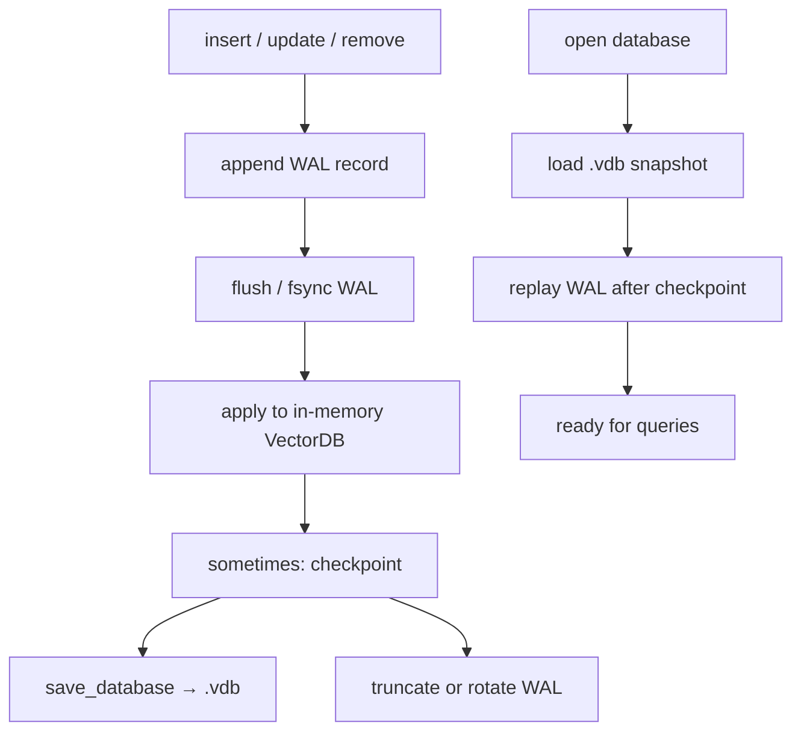

# Write-ahead log & crash recovery — detailed learning plan

We already have **snapshot persistence** (`save_database` / `load_database`). That is necessary but not enough: if the process dies mid-write, the `.vdb` file can be truncated or half-updated.

This note is the slow path — same style as Milestone 5 (ideas → tiny experiments → real code → crash tests). Do **one stage at a time**. Do not jump to crash injection before a clean append/replay works.

Full curriculum blurb: `[README_VectorDB_From_Scratch.md](../README_VectorDB_From_Scratch.md)` (Milestone 6).

---

## Why WAL exists (big idea)

```text
Without WAL:
  mutate memory → rewrite .vdb
  crash during rewrite → maybe corrupt / lost latest ops

With WAL:
  1) append intent to a log file
  2) make that append durable (flush / fsync)
  3) then change memory (and eventually the snapshot)
  crash → replay the log → get back to a valid committed state
```

**Reflection (answer in your own words before coding):**  
Why must the log become durable **before** the main data file is changed?

Hint: if the snapshot is new but the log never recorded the op, or the snapshot is torn and there is no log, you cannot tell what was committed.

---


## Vocabulary (learn these first)


| Term            | Meaning for us                                                       |
| --------------- | -------------------------------------------------------------------- |
| **WAL**         | Append-only file of intended changes                                 |
| **LSN**         | Log sequence number — monotonic id per record (`1, 2, 3, …`)         |
| **Atomicity**   | An operation fully happens or not at all (from the user’s view)      |
| **Durability**  | Once we say “committed,” it survives process death                   |
| **Replay**      | On open: read WAL records and re-apply committed ones                |
| **Idempotence** | Re-applying the same committed record twice must not break the DB    |
| **Checkpoint**  | Write a fresh `.vdb` snapshot so we can truncate/forget old WAL      |
| **fsync**       | Ask the OS to push file data to stable storage (not just page cache) |


**Resources (read in order, skim not binge):**

1. [SQLite: Write-Ahead Logging](https://www.sqlite.org/wal.html) — why a separate log, checkpoints
2. [CMU 15-445](https://15445.courses.cs.cmu.edu/) — recovery / logging lectures (any year)
3. Optional: ARIES overview later; we start simpler than full ARIES

**Checkpoint before Stage 0:** write 5–10 lines in this file or a scratch note defining WAL, LSN, checkpoint, and fsync in your words.

---


## How it fits our VectorDB




We **keep** the existing snapshot format. WAL is an extra file (e.g. `data/db.wal`) beside `data/db.vdb`.

---


## Suggested record format (decide, then freeze)

Same lesson as `.vdb`: sizes come from a **contract**, not from guessing.

```text
[record_length : u32]     total bytes of this record (or of payload — pick one and stick to it)
[lsn           : u64]
[op_type       : u32]     INSERT=1, UPDATE=2, DELETE=3, COMMIT=4, CHECKPOINT=5
[payload...]              depends on op_type
[checksum      : u32]     byte sum of everything before checksum (like .vdb)
```

**Payload sketches:**


| op              | Payload idea                                    |
| --------------- | ----------------------------------------------- |
| INSERT / UPDATE | `id (u64)` + `dims` floats (or rely on DB dims) |
| DELETE          | `id (u64)`                                      |
| COMMIT          | maybe empty, or `commit_lsn`                    |
| CHECKPOINT      | path or snapshot generation / last included LSN |


Start simple: **one user op = one WAL record that is already “the commit”** (no separate multi-record transaction yet). Add an explicit COMMIT type only if you want to practice the idea.

---


## Learning stages (do in order)


### Stage 0 — Mental model only (no code)

**Goals**

- Explain the 5-step single-op protocol out loud  
- Draw: memory vs `.vdb` vs `.wal` after insert, after crash mid-snapshot, after crash after WAL flush

**Protocol for one insert:**

1. Append INSERT record to WAL
2. Flush WAL
3. Apply insert in memory
4. (Optional later) write COMMIT if you use separate commits
5. Periodically checkpoint: `save_database` + record CHECKPOINT + truncate WAL

**Done when:** you can answer the reflection question above without looking it up.

---


### Stage 1 — WAL sandbox (like `format_sandbox`)

**Goals:** learn append-only binary I/O without touching `VectorDB`.

**Build:** `tools/wal_sandbox.cpp` (or similar)

1. Open/create a file `"wb"` / `"ab"`
2. Write one handmade record (fixed LSN=1, op=INSERT, tiny payload)
3. Close; reopen `"rb"`; read length → body → checksum; print fields
4. Append a second record; read **both** in a loop until EOF

**Checks**

- Truncated last record → detect via length / checksum / short `fread`  
- Bad checksum → reject

**Done when:** round-trip two records in a sandbox binary.

---


### Stage 2 — `WalWriter` / `WalReader` API (library, still no DB mutation)

**Goals:** clean types in `include/vectordb/wal.hpp` + `src/wal.cpp`.

Suggested surface (you design names):

```text
append(op, payload) → Status   // assigns next LSN, checksum, fwrite
flush() → Status               // fflush; later fsync
for_each_record(callback)      // or read_all into a vector
```

**Rules**

- Never rewrite the middle of the WAL — only append  
- LSN strictly increases  
- Same endian / fixed-width discipline as serializer

**Tests:** append N records, reopen, iterate, fields match; corrupt tail → stop or error cleanly.

**Done when:** unit tests pass with no `VectorDB` involvement.

---


### Stage 3 — Wire mutations: log first, then memory

**Goals:** `VectorDB::insert/update/remove` (or a wrapping `DurableVectorDB`) become:

```text
append WAL → flush → existing in-memory logic
```

**Important**

- If WAL append/flush fails → do **not** change memory  
- If memory apply fails after durable log → recovery must still be defined (usually: record is committed, replay will re-apply — so memory apply should be made reliable or replay-idempotent)

**Tests:** after insert, `.wal` grew; kill is not needed yet — just file size / record count.

**Done when:** every successful mutation leaves a matching WAL record.

---


### Stage 4 — Replay on open

**Goals:** startup path:

```text
load .vdb (or empty DB) → replay WAL → DB matches “last durable state”
```

**Idempotence rules to decide**

- Replaying INSERT of existing id → treat as ok / skip / or require UPDATE semantics  
- Replaying DELETE of missing id → ok  
- Document the choice in this note

**Tests**

1. Mutate + checkpoint + clear WAL → open → state from snapshot only
2. Mutate without checkpoint → kill process simulation (close without save) → reopen → replay restores ops
3. Snapshot + more WAL ops → reopen → snapshot then replay

**Done when:** reopen without an explicit `save` still restores committed ops via WAL.

---


### Stage 5 — Checkpoint

**Goals:**

1. `save_database` to `.vdb`
2. Append CHECKPOINT record (include last LSN included in snapshot)
3. Truncate WAL or start a new WAL file

**Why:** unbounded WAL = slow open and huge disk.

**Tests:** many ops → checkpoint → WAL small → reopen still correct.

**Done when:** checkpoint is explicit API or automatic every N ops.

---


### Stage 6 — Crash injection (the real exam)

**Goals:** a debug hook, e.g. env var or `CrashPoint` enum:

```text
BeforeWalAppend
AfterWalAppendBeforeFlush
AfterWalFlush
AfterMemoryApply
AfterCheckpointSnapshot
AfterCheckpointBeforeTruncateWal
```

Process `abort()` or `_exit(1)` at that point. Separate test process or `fork` reopens the DB and asserts invariants.

**Minimum crash matrix**


| Crash point                             | Expected after recovery                                          |
| --------------------------------------- | ---------------------------------------------------------------- |
| Before WAL append                       | Op not present                                                   |
| After flush, before/during memory apply | Op **present** (replay)                                          |
| During snapshot write                   | Old snapshot + WAL still recover OR reject bad snapshot + replay |
| After checkpoint, before WAL truncate   | Recover from new snapshot; WAL replay must not double-break      |


**Done when:** the matrix is automated in GoogleTest (or a small crash harness).

---


### Stage 7 — fsync and durability honesty

**Goals:** understand `fflush` ≠ durable. On Unix, durability needs `fsync(fileno(file))` (and sometimes `fsync` on the directory for renames).

**Learn:** OS page cache can lie across power loss; for this project, document “process crash” vs “power loss” scope.

**Done when:** `WalWriter::flush` documents what it guarantees, and tests cover process crash at least.

---


## What we are *not* doing yet

- Multi-statement transactions / rollback  
- Full ARIES (undo + redo + dirty page table)  
- Concurrent writers  
- Segmented LSM storage (that’s the next major topic after WAL basics)

Keep the WAL **simple and correct** first.

---


## Suggested file layout when you start coding

```text
include/vectordb/wal.hpp
src/wal.cpp
tools/wal_sandbox.cpp
tests/wal_test.cpp
data/*.wal          # local only
notes/06-wal-learning.md   # this file — update “Decisions” below as you go
```

---


## Decisions log (fill in as you decide)


| Decision                        | Choice                                                 | Date    |
| ------------------------------- | ------------------------------------------------------ | ------- |
| WAL path naming                 | caller-supplied path beside `.vdb`                     | 2026-08 |
| record_length covers …          | lsn+op+payload+checksum (not the length field)         | 2026-08 |
| Separate COMMIT record?         | no — one user op = one durable record                  | 2026-08 |
| Replay INSERT if id exists      | treat `duplicate_id` as ok (idempotent redo)           | 2026-08 |
| Replay DELETE if missing        | treat `not_found` as ok                                | 2026-08 |
| Checkpoint trigger              | explicit `VectorDB::checkpoint`                        | 2026-08 |
| CHECKPOINT WAL record           | after save, before truncate; payload `checkpoint_lsn`; replay no-op; WAL still truncated | 2026-08 |
| fsync in flush?                 | yes (`fflush` + `fsync`); process-crash scope          | 2026-08 |
| Crash after append before flush | often **present** on process crash here (`fwrite` may already be in kernel); durable point we document is still `AfterWalFlush` | 2026-08 |


---


## Pace reminder

Same as persistence:

1. Read / write your own words
2. Draw
3. Sandbox one record
4. Library append/read
5. Wire to DB
6. Replay
7. Checkpoint
8. Crash tests

When stuck: stop at the stage boundary and ask — don’t “finish WAL” in one jump.

---

## Milestone 6 status (2026-08)

**Complete for Version 0.2:** WAL library, log-before-mutate, `fflush`+`fsync`, `open`/replay, checkpoint + CHECKPOINT record, crash hooks + fork harness/matrix, idempotent replay.

**Next curriculum:** Milestone 7 — segments, memtable, tombstones, compaction (LSM-style).
