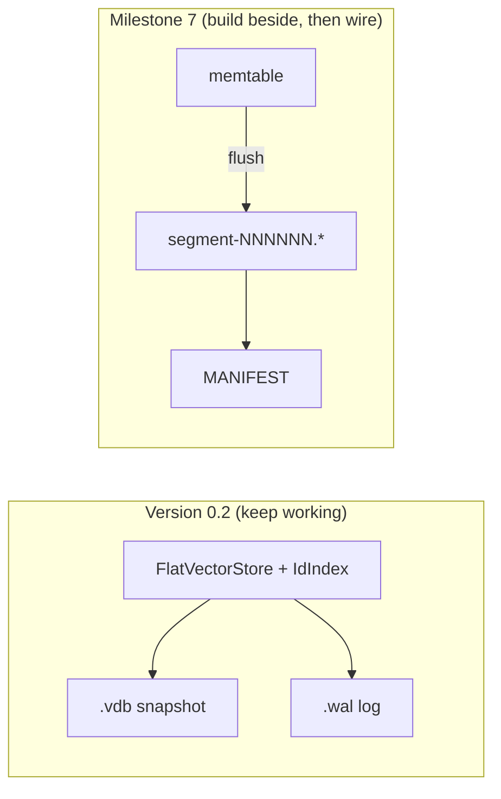
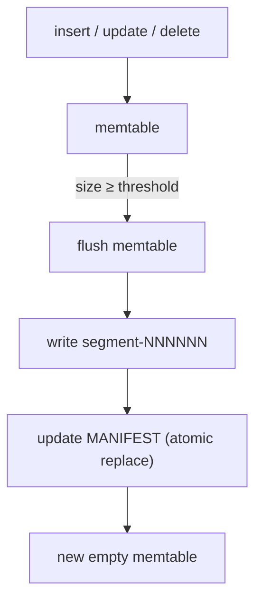

# Segments, tombstones, and compaction — detailed learning plan

We finished **Version 0.2**: one in-memory store, a `.vdb` snapshot, WAL + checkpoint + crash recovery. That model works, but rewriting one giant snapshot gets expensive as data grows — cost scales with **total** database size, not just the latest writes.

Milestone 7 moves toward **LSM-style** storage: append-only immutable files, a small mutable buffer, and occasional merge (compaction). Same slow path as earlier milestones: ideas → sandbox → library → wire to DB → tests.

Full curriculum: [`README_VectorDB_From_Scratch.md`](../README_VectorDB_From_Scratch.md) (Milestone 7).

---

## Why segments exist (big idea)

```text
Version 0.2 (today):
  mutate RAM → occasionally rewrite entire .vdb
  cost of checkpoint grows with ALL vectors, even if you only inserted a few

Version 0.3+ (target):
  writes → memtable (small, mutable, in RAM)
         → flush when full → new immutable segment file (only that batch)
         → many segment files over time
         → compact when too many / too much garbage
```

**Why rewrite hurts:** every checkpoint walks and serializes the full store. As `N` grows, each save is O(N) work and O(N) bytes written even for one new row.

**Why append helps:** a flush only writes what was in the memtable since the last flush — work proportional to the **batch**, not the whole history.

**Reflection:**  
Why is a frozen segment file **never edited** after flush? (Hint: immutability simplifies crashes and concurrent readers later.)

---

## Vocabulary (learn these first)

| Term | Meaning for us |
|------|----------------|
| **Memtable** | Mutable in-memory buffer for live inserts/updates/deletes |
| **Segment** | Immutable on-disk file produced by flushing a memtable |
| **Flush** | Freeze memtable contents → write one new segment; start fresh memtable |
| **MANIFEST** | Small durable file listing which segment files are part of the live DB |
| **Tombstone** | Delete marker for an id — hides older values without editing old files |
| **Newest-wins** | Lookup/search consults memtable first, then segments newest → oldest |
| **Compaction** | Merge several segments into fewer files; drop stale versions and honored tombstones |
| **LSM-tree** | Family of designs: memtable + sorted immutable runs + merge |

**Resources (skim, don’t binge):**

1. [The Log-Structured Merge-Tree paper](https://www.cs.umb.edu/~poneil/lsmtree.pdf) — figures + intuition
2. CMU 15-445 storage / LSM lectures (any year)
3. Compare mentally to our WAL note: WAL = intent log; segments = bulk data layout

---

## How it fits our VectorDB today



**Important:** tickets #9–#15 build segment pieces **without** breaking the existing `.vdb` + WAL path until we explicitly integrate. Two storage stories can coexist during learning.

---

## Architecture sketch

### On-disk layout (target)

```text
data/
├── MANIFEST              # which segments are live (source of truth)
├── db.wal                # optional; may stay for durability — wiring TBD in M7
├── segment-000001.vec    # immutable vector payload (format TBD in #9)
├── segment-000001.meta   # optional sidecar (counts, schema, tombstone stats)
├── segment-000001.idx    # optional id index for faster lookup
└── segment-000002.vec    # next flush produces a sibling file, not an edit of 000001
```

### Write path



### Read path (newest-wins)

```text
get(id):
  1) memtable — if hit (value or tombstone), done
  2) segment-00000K (newest) … down to segment-000001
  3) first record for id wins; tombstone ⇒ not found
```

```text
Example:
  segment-000001 has id 42 = [1, 0]
  memtable has id 42 = [9, 8]   → get(42) returns [9, 8]
  memtable has tombstone for 42 → get(42) not found (ignore segment-000001)
```

**Do not** edit old segment files on update/delete. New truth lives in memtable (later in a newer segment).

### Compaction

```text
segment-001 + segment-002 + segment-003
        │ merge (newest-wins per id, apply tombstones)
        ▼
   segment-004  (clean)
        │
        ▼
   MANIFEST now lists [004] instead of [001, 002, 003]
   old files deleted only after MANIFEST swap is durable
```

Compaction is **merge**, not “keep only the newest N segment files.” Dropping old files without merging would lose ids that exist only in older segments.

---

## Memtable vs segment (mental model)

| | Memtable | Segment |
|---|----------|---------|
| Location | RAM | Disk |
| Mutable? | Yes | No (immutable after flush) |
| Size | Small (threshold-triggered flush) | Fixed at write time |
| New writes after flush | Go here | Old segment untouched |

After flush: memtable → frozen into **one new segment file** → **new empty memtable**. The new segment is a **sibling**, not a patch on the previous file.

---

## Tombstones across files

We already tombstone inside one `FlatVectorStore`. Milestone 7 extends the idea:

- **Delete** writes a tombstone entry in the memtable (not “remove id from map silently”).
- On flush, tombstones can be persisted inside the segment.
- **Newest tombstone** hides all older values for that id in older segments.
- Physical bytes may remain until **compaction** reclaims space.

---

## MANIFEST

Without a manifest, reopen would guess from whatever `.vec` files exist in a directory — unsafe after crashes or partial writes.

MANIFEST responsibilities:

- List live segment ids/paths (and optionally generation / level later)
- Updated **atomically** after flush or compaction (write temp + rename, or equivalent)
- Loaded first on `open` → then open listed segments only

---

## Relationship to WAL / checkpoint (0.2)

| Mechanism | Role |
|-----------|------|
| WAL | Durability of **recent ops** since last durable bulk state |
| `.vdb` checkpoint | Single-file **photo** of full RAM (0.2 model) |
| Segments + MANIFEST | Append-only **bulk** state; avoid rewriting entire photo |

Long term, real systems combine these (log + LSM). For this learning repo: build segment machinery in M7 tickets first; decide later whether WAL feeds memtable directly or stays parallel to `.vdb` until a integration milestone.

---

## Learning stages (tickets #8–#15)

| Stage | Ticket | Goal |
|-------|--------|------|
| 0 | **#8** (this note) | Vocabulary + architecture + decisions |
| 1 | **#9** | Segment file format + sandbox round-trip |
| 2 | **#10** | Memtable (`std::map`) + flush threshold |
| 3 | **#11** | Flush memtable → segment file |
| 4 | **#12** | MANIFEST load + atomic replace |
| 5 | **#13** | Read path: memtable + segments, newest first |
| 6 | **#14** | Tombstones hide older segment data |
| 7 | **#15** | Compaction merge + manifest swap |

Do **one ticket at a time**. Do not implement compaction before reads work; do not wire VectorDB before segment format round-trips.

---

## Decisions log (fill in as you go)

| Decision | Choice | Date |
|----------|--------|------|
| Memtable v1 | `std::map<uint64_t, Entry>` — skip list optional later | 2026-08 |
| Segment naming | `segment-NNNNNN.vec` (+ `.meta` / `.idx` when needed) | 2026-08 |
| Flush threshold | **row count** first (bytes threshold later) | 2026-08 |
| Segment format | TBD in #9 (magic, version, records, checksum like `.vdb`) | |
| v0.2 `.vdb` + WAL | Keep working; segment path built beside until integration | 2026-08 |
| Compaction trigger | Manual API first (`compact()`); auto policy later | 2026-08 |
| MANIFEST atomicity | Write temp + rename over `MANIFEST` (document in #12) | 2026-08 |
| WAL + segments integration | Deferred — note open questions here when decided | |

---

## Open questions (resolve during implementation)

1. Does one segment file embed tombstones inline, or separate `.meta`?
2. Exact top-k during M7: scan all visible vectors (memtable + all live segments) — acceptable for learning?
3. When do we stop using monolithic `.vdb` as the primary store?

---

## Pace reminder

Same as persistence and WAL:

1. Read / write your own words  
2. Draw layout and data flow  
3. Sandbox one segment record  
4. Library write/read segment  
5. Memtable + flush  
6. MANIFEST  
7. Read path + tombstones  
8. Compaction  

When stuck: stop at the ticket boundary — don’t “finish LSM” in one jump.

---

## Milestone 7 status

**#8 complete:** architecture note written. **Next:** #9 segment format sandbox.
