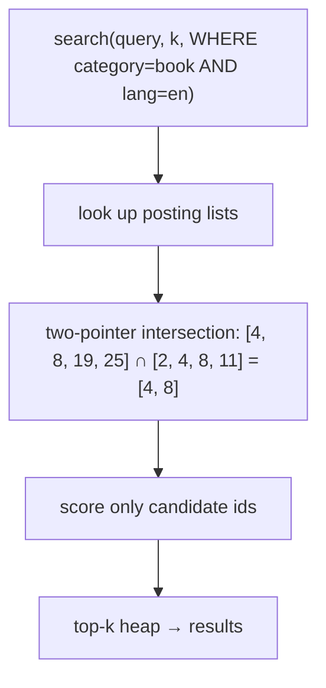

# Metadata storage and filtering — detailed learning plan

Milestone 7 gave us an LSM storage engine, and `VectorDB` now defaults to it. But every query is still "nearest to this vector, period." Real workloads almost always constrain the candidates first:

```text
SEARCH query_vector TOP 10
WHERE category = "book" AND year >= 2000
```

Milestone 8 (Part III of the curriculum) adds **metadata** — typed key/value pairs attached to each vector — and **equality filtering** over it. Range filters (`year >= 2000`) come later with the B+ tree (M10); this milestone is equality only.

Full curriculum: [README_VectorDB_From_Scratch.md](../README_VectorDB_From_Scratch.md) (Milestone 8).

---

## Why metadata exists (big idea)

```text
Today:
  search(query, k) scans every live vector → top-k by score
  "only books" means the caller filters afterward and hopes k was big enough

Target:
  search(query, k, {category = "book"})
  → intersect posting lists → candidate ids → score only those → top-k
```

**Why post-filtering hurts:** if 1% of vectors are books and you want 10 book results, you must over-fetch (k = 1000?) and still might miss. Filtering **before** scoring turns "top-k of everything, then discard" into "top-k of exactly the right set."

**Reflection:**
Why does the inverted index map *values → ids* instead of *ids → values*? (Hint: the query arrives knowing the value, not the ids.)

---

## Vocabulary (learn these first)

| Term | Meaning for us |
| ---- | -------------- |
| **Metadata** | Typed key/value pairs attached to one vector id |
| **Schemaless** | Each vector may carry different fields; no declared table schema |
| **Typed value** | `std::variant<int64_t, double, bool, string>` — the type travels with the value |
| **Predicate** | One condition, e.g. `category = "book"` |
| **Inverted index** | field → value → list of ids having that value |
| **Posting list** | Sorted vector of ids for one (field, value) pair |
| **Intersection** | ids satisfying *all* predicates — two-pointer walk over sorted lists |
| **Pre-filtering** | Intersect posting lists first, score only candidates |
| **Post-filtering** | Score everything, discard non-matching afterward |

**Resources (skim, don't binge):**

1. Any inverted-index / posting-list chapter (information-retrieval textbooks, e.g. Manning's IR book ch. 1–2)
2. `std::variant` + `std::visit` reference — this is also a C++ learning goal
3. Compare mentally to M7: posting lists are to filters what segments are to storage — sorted, mergeable building blocks

---

## Initial types (locked by curriculum)

```cpp
using MetadataValue = std::variant<std::int64_t, double, bool, std::string>;
using Metadata = std::unordered_map<std::string, MetadataValue>;
```

Schemaless on purpose: two vectors can have different fields. A "missing field" is an ordinary lookup miss, not an error.

---

## Architecture sketch

### Equality index shape

```text
category
├── book  → [4, 8, 19, 25]     ← sorted posting lists
└── movie → [2, 6, 11]

lang
├── en    → [2, 4, 8, 11]
└── de    → [6, 19]
```

### Filtered query flow



### Mutation flow (index maintenance)

```text
insert(id, values, metadata):
  for each (field, value) → posting_list.insert(id)

update metadata (field changes value):
  old value's list: erase(id)
  new value's list: insert(id)

remove(id):
  every list containing id: erase(id)
```

The test matrix from the curriculum maps straight onto this: missing fields, wrong value type, single/multiple filters, updates that change indexed metadata, deletion from posting lists.

---

## Pre-filter vs post-filter (mental model)

| | Pre-filter | Post-filter |
| - | ---------- | ----------- |
| Work | Intersect small sorted lists, score few | Score all N, then discard |
| Correctness | Exact k matching results | May return < k after discard |
| When it wins | Selective filters (few matches) | Filters that match almost everything |

We implement **pre-filter** and keep a brute-force post-filter as the test oracle — same trick as M4, where the min-heap search was checked against a full sort.

---

## Relationship to the LSM backend

Metadata this milestone is **in-memory only**: a side map `id → Metadata` plus the inverted index, rebuilt from nothing on process start. Durability (metadata inside segment files or a sidecar) is a real design question — deferred, logged below. This mirrors M7's "build beside, wire later" pace: get the semantics and index right before touching the segment format.

---

## Learning stages (tickets #16–#20)

| Stage | Ticket | Goal |
| ----- | ------ | ---- |
| 0 | **#16** (this note) | Vocabulary + architecture + decisions |
| 1 | **#17** | `MetadataValue` / `Metadata` types; attach to vectors; get/update/remove semantics |
| 2 | **#18** | Sorted posting list + two-pointer intersection (standalone + tests) |
| 3 | **#19** | Equality inverted index; maintained on insert/update/remove |
| 4 | **#20** | `search(query, k, filter)` — pre-filter vs post-filter oracle |

Do **one ticket at a time**. Posting lists before the index; the index before filtered search.

---

## Decisions log (fill in as you go)

| Decision | Choice | Date |
| -------- | ------ | ---- |
| Metadata type | `std::variant<int64_t, double, bool, string>` per curriculum | 2026-08 |
| Schema | Schemaless — fields optional per vector | 2026-08 |
| Filter scope M8 | Equality only; AND-only combination (ranges → M10, OR later) | 2026-08 |
| Index structure | `unordered_map<field, map<value, PostingList>>`, posting list = sorted `vector<uint64_t>` | 2026-08 |
| Filter strategy | Pre-filter via posting-list intersection; post-filter kept as test oracle | 2026-08 |
| Metadata durability | **Deferred** — in-memory only this milestone; segment/sidecar format later | 2026-08 |
| Wrong-type lookup | Reading field as wrong type → empty/`nullopt`, not a crash |  |

---

## Open questions (resolve during implementation)

1. Does `update(id, values)` (vector only) touch metadata, or is metadata updated through a separate call?
2. How do typed values compare inside one field — can `category` hold both `"book"` and `42`? (Index must not conflate them.)
3. Where does metadata live long-term: inside `VECSEG` rows, a sidecar `.meta` file per segment, or a separate store?

---

## Pace reminder

Same as WAL and segments:

1. Read / write your own words
2. Draw the index shape and query flow
3. Posting list alone, with tests
4. Inverted index, with tests
5. Filtered search wired into `VectorDB`

When stuck: stop at the ticket boundary — don't "finish filtering" in one jump.
