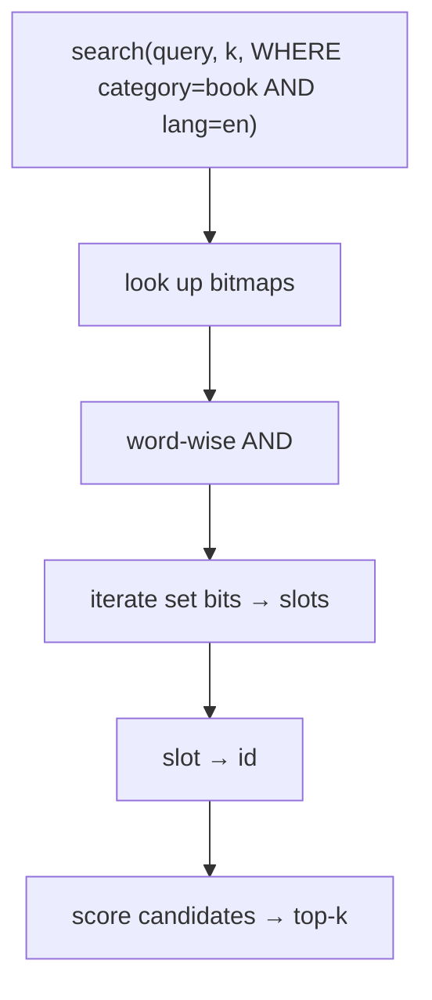

# Bitmap indexes — detailed learning plan

Milestone 8 gave us **equality filters** via posting lists: `field → value → sorted ids`, then two-pointer intersection. That is the right tool when a value matches a **small** slice of the database.

Milestone 9 (Part III of the curriculum) adds a second representation of the same idea: **bitmaps**. Same query (`category = book AND lang = en`), different data structure — cheap when a field has **few distinct values** and each value matches **many** rows.

Full curriculum: [README_VectorDB_From_Scratch.md](../README_VectorDB_From_Scratch.md) (Milestone 9). Range filters stay M10 (B+ tree). A planner that *chooses* list vs bitmap is M11.

---

## Why bitmaps exist (big idea)

```text
Today (M8):
  lookup posting lists → intersect ids → score candidates
  cost scales with how many ids MATCH (k)

Target (M9):
  lookup bitmaps → bitwise AND → iterate set bits → score
  cost scales with universe size N, in 64-bit chunks (N/64)
```

**Why posting lists hurt on dense filters:** `active = true` matching 80% of 1M rows is an 800k-id vector (~6.4 MB). Intersecting it means walking hundreds of thousands of `uint64_t`s.

**Why bits help:** the same set is 1M bits (~125 KB). AND with another bitmap is ~15k machine-word operations. Dense filters get *cheaper*, not more expensive.

**Reflection:**
Why does a bitmap's cost depend on **N** (how many vectors exist) while a posting list's cost depends on **k** (how many match)? When would paying for N be a bad deal?

---

## Vocabulary (learn these first)

| Term | Meaning for us |
| ---- | -------------- |
| **Bit array / bitset** | Packed bits, usually 64 per `uint64_t` word |
| **Cardinality (of a field)** | How many distinct values (`lang`: en/de/fr → 3) |
| **Low-cardinality** | Few distinct values — good bitmap candidate |
| **Selectivity** | Fraction of rows that match a predicate |
| **Dense set** | Many bits are 1 (e.g. 80% `active`) |
| **Sparse set** | Few bits are 1 (e.g. 0.1% `sku=X`) |
| **Universe / slot** | Bitmap position `0..N-1`; not necessarily the vector id |
| **Population count** | Number of 1-bits (`std::popcount`) |
| **Bitwise AND / OR / XOR / NOT** | Combine filters (AND = all, OR = any) |
| **Set-bit iteration** | Walk only 1-bits; skip empty words |
| **Roaring bitmap** | Hybrid: per-chunk array vs bitmap vs runs (stretch) |

**Resources (skim, don't binge):**

1. Bitwise ops + `std::popcount` / `std::countr_zero` (C++20 `<bit>`)
2. Any database bitmap-index intro (low-cardinality columns)
3. [Roaring bitmaps](https://roaringbitmap.org/) — stretch only
4. Compare mentally to M8: posting lists pay for hits; bitmaps pay for N

---

## Posting list vs bitmap (when each wins)

Fix **N = 1,000,000** vectors.

| matches k | Posting list memory | Bitmap memory | Winner |
| --------- | ------------------- | ------------- | ------ |
| 10 | 80 B | 125 KB | **list** |
| 16,000 (~1.6%) | ~128 KB | 125 KB | about even |
| 800,000 | 6.4 MB | 125 KB | **bitmap** |

| Situation | Better tool |
| --------- | ----------- |
| High cardinality, selective (`sku`, `user_id`) | Posting list |
| Low cardinality, dense-ish (`lang`, `status`, `active`) | Bitmap |
| AND of several flag-like fields | Bitmap (AND is O(N/64) no matter how dense) |
| Huge sparse id space, no slot map | Posting list (can't allocate 2^64 bits) |

M9 does **not** replace M8. Build the bitset beside the equality index. Wiring into `search` can wait until the structure and benchmarks are solid.

---

## Architecture sketch

### Bitset layout

```text
positions:  0  1  2  3  4  5  6  7  ...  63 | 64  65 ...
words_[0]:  1  0  1  1  0  0  1  0  ...     | words_[1]: ...
             ↑ bit 0 of word 0                ↑ bit 0 of word 1

word index = i / 64
bit  index = i % 64
set(i):  words_[i/64] |=  (1ULL << (i%64))
test(i): words_[i/64] &   (1ULL << (i%64))
```

### The slot problem (IDs are not bit positions)

M8 posting lists store **real ids** (`4, 8, 19`). A bitmap is one bit per **slot**. Arbitrary `uint64_t` ids cannot be used as indices.

```text
id 4  → slot 0
id 8  → slot 1
id 19 → slot 2
```

Need:

- `id → slot` (lookup on insert/remove/filter)
- `slot → id` (after AND, turn set bits back into vector ids)

**Decision to log:** dense slot assignment (append on insert, leave holes on delete vs recycle). Holes are simpler; recycling is a later optimization.

### Index shape (same as M8, different leaf)

```text
M8 EqualityIndex:  field → value → PostingList   (sorted ids)
M9 BitmapIndex:    field → value → Bitset        (bits over slots)
```

```text
category
├── book  → 1 0 1 1 0 0 1 0
└── movie → 0 1 0 0 1 1 0 1

lang
├── en    → 1 1 1 0 0 1 1 0
└── de    → 0 0 0 1 1 0 0 1
```

### Filtered query flow



Hand example (8 vectors):

```text
book:  1 0 1 1 0 0 1 0
en:    1 1 1 0 0 1 1 0
AND:   1 0 1 0 0 0 1 0   → slots 0, 2, 6
```

Same answer as posting-list intersection; different work.

### Mutation flow

```text
insert(id, metadata):
  assign next slot (or reuse a free slot)
  for each (field, value): bitmap.set(slot)

set_metadata / update:
  old value's bitmap: clear(slot)
  new value's bitmap: set(slot)

remove(id):
  for each (field, value): bitmap.clear(slot)
  optionally free the slot
```

Keep the equality index working; do not break M8 tests when adding bitmaps.

---

## Set-bit iteration (don't scan zeros)

Naive: `for i in 0..N-1: if test(i) ...` — O(N) even if three bits are set.

Fast path:

```text
for each word:
  if word == 0: skip 64 positions
  while word != 0:
    bit = countr_zero(word)   // lowest set bit
    slot = word_index * 64 + bit
    word &= word - 1          // clear lowest set bit
```

`popcount(word)` counts matches in one instruction — useful for selectivity estimates later (M11).

---

## Dense vs sparse / Roaring (stretch)

A raw bitset always costs **N bits** per (field, value), even if only 3 bits are 1.

**Roaring** (optional, later ticket): split the universe into 2^16-bit containers; each container is a dense bitmap, a sorted array, or a run. Sparse chunks pay for hits; dense chunks pay N_chunk bits.

Not required to finish M9. Learn the uncompressed bitset first.

---

## Relationship to VectorDB today

- Metadata + `EqualityIndex` are **in-memory only** (M8 decision). Bitmaps start the same way.
- LSM vs legacy: slots are an **in-memory** dense numbering of live (or ever-inserted) ids, not segment file offsets.
- Filtered `search` already pre-filters via posting lists. M9 can land as a standalone `Bitset` + tests + benchmark **before** swapping the search path.
- Durability of metadata/indexes remains deferred.

---

## Learning stages (tickets)

| Stage | Ticket | Goal |
| ----- | ------ | ---- |
| 0 | **M9.1** (this note) | Vocabulary + architecture + list-vs-bitmap + slot problem |
| 1 | **M9.2** | Dynamic `Bitset`: set / clear / test / grow |
| 2 | **M9.3** | AND / OR / XOR / NOT + iterate only set bits |
| 3 | **M9.4** | `BitmapIndex` + id↔slot map; add/remove/lookup |
| 4 | **M9.5** | Benchmark vs `unordered_set` (and posting list); optional VectorDB wire |
| 5 | stretch | Simplified Roaring container |

Do **one ticket at a time**. Bitset before AND; AND before the index; index before wiring search.

---

## Decisions log (fill in as you go)

| Decision | Choice | Date |
| -------- | ------ | ---- |
| M8 posting lists | Keep; bitmaps are additional | 2026-09 |
| Bitset storage | `std::vector<uint64_t>` words, 64 bits/word | 2026-09 |
| Slot mapping | Dense incrementing slots; holes on delete for v1 | |
| Which fields get bitmaps | Low-cardinality only — or all fields and let memory teach us | |
| Wire into `search` | Deferred until bitset + index + bench are green | |
| Roaring | Stretch, not required | 2026-09 |
| Durability | In-memory only, same as M8 metadata | 2026-09 |

---

## Open questions (resolve during implementation)

1. Are slots assigned per-`VectorDB` (global dense 0..size-1) or per-index?
2. After `remove`, do we leave a zero bit (hole) or compact / recycle the slot? Compacting would shift later bits — expensive.
3. Do we bitmap every equality field, or only fields the caller marks as low-cardinality?
4. Should `BitmapIndex` replace posting lists for some lookups, or sit beside them until M11?

---

## Pace reminder

Same as WAL, segments, and metadata:

1. Read / write your own words
2. Draw 8-bit AND by hand
3. `Bitset` alone, with tests
4. Combine + iterate, with tests
5. Index + slot map, with tests
6. Benchmark before rewriting `search`

When stuck: stop at the ticket boundary — don't "finish bitmaps" in one jump.
